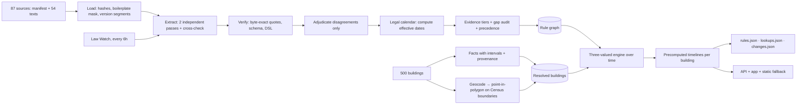

<div align="center">

# Tenantly

**The housing law that reaches your door: cited, dated, and checked against your building.**

Address in. Every applicable rent, eviction, deposit, fee, screening and rent-setting-software rule out, each quoted word-for-word from the law, with its source, retrieval date, and the limits of what we could verify.

[Live app](‹LIVE_APP_URL›) · [API docs](‹API_URL›/docs) · [Proof page](‹LIVE_APP_URL›/proof) · [Method note](METHOD_NOTE.md) · [Demo video](‹VIDEO_URL›)

*Information, not legal advice.*

</div>

---

> **How to read this README.** Every number marked ‹measured› is filled in from `artifacts/eval/` by `make method-note` before submission. If you see a placeholder, the measurement has not been run. We never estimate results by hand.

## Contents
1. [The problem](#1-the-problem)
2. [What Tenantly does](#2-what-tenantly-does)
3. [Results](#3-results)
4. [How it works](#4-how-it-works)
5. [Decisions that matter](#5-decisions-that-matter)
6. [Honesty by design](#6-honesty-by-design)
7. [Reproduce everything](#7-reproduce-everything)
8. [Outputs](#8-outputs)
9. [API](#9-api)
10. [Repository map](#10-repository-map)
11. [Limitations](#11-limitations)
12. [Where this goes](#12-where-this-goes)
13. [Credits and licenses](#13-credits-and-licenses)

---

## 1. The problem

Rental housing in the U.S. is regulated in layers: state statutes, city ordinances and pending bills, each with its own coverage tests (building age, unit count, owner type), effective dates and exemptions. Whether a rule applies to *one apartment* depends on its exact legal location and the date you ask. Both are easy to get wrong:

- **A mailing city is not a legal city.** 37 of our 110 Massachusetts sample buildings are mailed as Dorchester, Roxbury, Allston and other neighborhoods. Legally they are all in Boston.
- **Enacted is not in effect.** New Jersey's FAIR Act was signed on July 20, 2026, but takes effect on July 1, 2027. The text never says "July 1, 2027"; it says "the first day of the twelfth month next following the date of enactment."
- **Proposed is not law, and struck is not law.** Massachusetts has pending algorithmic-pricing bills and a rent-control ballot question struck by the state's high court. A tool that reports them as rules misleads renters.
- **Public records are incomplete.** 212 of the 500 sample buildings have no year built, and owner type is never public. The honest answer is often "we can't tell from public data", and it should come with the one fact that would settle it.

Renters can't afford to get this wrong, small landlords can't afford lawyers, and advocates can't see across jurisdictions. The source text is public but scattered, unstructured and constantly changing.

## 2. What Tenantly does

| For a renter | For an advocate or agency | For a small housing provider |
|---|---|---|
| Type an address and see, per category, what applies, what starts later, and what is only proposed | Pick a law change and see which buildings it reaches, before and after | See coverage conditions and exemptions spelled out, with the law's own words |
| Read the exact sentence of law behind every answer, with the date it was retrieved | Conflict flags where state and local law may collide | Never advice, never ways around a rule |
| Plain English or Spanish, read aloud, accessible | CSV-ready change sets and an audit log | The same evidence a lawyer would start from |

Built for the RealPage *Rental Housing Law Navigator* challenge: **3 states, 10 cities, 6 rule categories, 500 real buildings**, from a corpus of 87 sources (54 with supplied text).

## 3. Results

All values are measured; see `artifacts/eval/` and the [Proof page](‹LIVE_APP_URL›/proof).

**Self-score.** The starter pack ships no answer key or scorer. We built a scorer that mirrors the published rubric and a silver key from our own reading of the corpus. The silver key is never read by the pipeline (enforced by a test).

| Component | Points | Self-score |
|---|---|---|
| Extraction accuracy | 25 | ‹measured› |
| Address coverage | 20 | ‹measured› |
| Citations | 15 | ‹measured› |
| Change tracking | 15 | ‹measured› |

**Change tests.** These are checked exactly against the test definitions, computed from resolved legal cities.

| Test | What it checks | Expected | Ours | Pass |
|---|---|---|---|---|
| T1 | CA AB 325, 2025-12-31 → 2026-01-02 | all 250 CA buildings change | ‹measured› | ‹✓/✗› |
| T2 | Hoboken vs Jersey City bans | 40 + 50, none in Newark | ‹measured› | ‹✓/✗› |
| T3 | NJ FAIR Act, 2026-10-01 → 2027-07-02 | 140 NJ; 90 conflict flags | ‹measured› | ‹✓/✗› |
| T4 | MA S.2983 / H.5222 (pending) | 110 MA, reported as pending | ‹measured› | ‹✓/✗› |
| T5 | MA rent-control ballot question (struck) | empty; recorded as failed | ‹measured› | ‹✓/✗› |
| T6 | Hour-16 ordinance (if released) | — | ‹measured› | ‹✓/✗› |

**Integrity and performance.**

| Metric | Value |
|---|---|
| Rules extracted (Tier A / B / C / C1) | ‹measured› |
| Tier A/B quotes verified byte-for-byte against the corpus | ‹measured› (target 100%) |
| Candidate rules rejected because their quote wasn't in the source | ‹measured› |
| Fields resolved by the adjudicator model | ‹measured› |
| Buildings resolved by geometry / mailing-city mismatches caught | ‹measured› / ‹measured› |
| Suspect ZIP codes dropped before geocoding | ‹measured› |
| Unit counts recovered from public-record descriptions | ‹measured› |
| Public records that contradict each other (flagged, never guessed) | ‹measured› |
| Mean reading grade of renter summaries (EN) | ‹measured› (gate ≤ 8.5) |
| Lookup latency p50 / p95 (server) | ‹measured› |
| Same question via retrieval + LLM (baseline) | ‹measured› |
| Total model spend to compile the corpus | ‹measured› |

## 4. How it works

Tenantly is a **law compiler**, not a chatbot. Models read the law once, at compile time, into a verified, time-aware rule graph. Answering an address is deterministic code over that graph, with no model call in the loop.



**Compile time** (about ‹measured› minutes, about $‹measured›; cached reruns cost nearly nothing):
1. **Load.** Verify each document's sha256 against the manifest. Mask web boilerplate *without* changing offsets. Split statutes that contain several versions ("effective until August 1, 2025" / "effective August 1, 2025") into dated segments.
2. **Extract.** Two independent Claude Sonnet passes (section view and whole-document view) plus a Claude Haiku cross-check. Disagreements go to a Claude Opus adjudicator, which must cite the deciding span.
3. **Verify.** Every quoted span must be an exact substring of the raw source at recorded offsets. Anything else is rejected.
4. **Compute dates.** Models extract date *expressions*; code computes the dates (e.g. "first day of the twelfth month next following the date of enactment" + "approved July 20, 2026" → **2027-07-01**).
5. **Audit gaps.** A 13 × 6 jurisdiction-by-category matrix must end fully explained: each cell holds a rule or a reasoned "no rule at this level" (barred by state law, motion only, only pending, failed, text not supplied).
6. **Link.** Precedence and conflicts become explicit relations with quoted evidence (e.g. the state rent cap yields to stricter local rent control; the FAIR Act prohibits conflicting municipal ordinances).

**Query time** (milliseconds):
1. **Resolve** the building's legal city by point-in-polygon on Census TIGER boundaries (incorporated places in California, county subdivisions in New Jersey and Massachusetts), never by mailing city.
2. **Evaluate** each rule's coverage with three-valued logic over interval facts.
3. **Serve** a precomputed timeline, so moving the date slider triggers no network requests.

## 5. Decisions that matter

| Decision | Typical approach | Tenantly | Why it matters |
|---|---|---|---|
| Where models run | Every query | Compile and ingest only | Millisecond answers; no query-time hallucination; reproducible output |
| Citations | Model-written | Byte-exact spans verified at recorded offsets | Citation validity is a property of the system, not a hope |
| Dates | Model guesses | Deterministic legal calendar (NJ "Nth month next following", California regular-session default validated against the corpus's own history notes, Massachusetts version markers) | The rules most likely to be misdated are dated correctly |
| Missing facts | Guess, or treat as false | Kleene logic over intervals: a 1978 building is "unknown" against a 1978-10-01 cutoff; a 21-unit building *cannot* use a ≤4-unit exception | "Unknown" is computed, explained, and paired with the one question that resolves it |
| Building facts | Use what's in the cell | Derive with provenance (NJ property class 4C → 5+ units; MOD-IV "6U" → 6 units); intersect sources; flag contradictions | Recovers unit counts the parcel data left blank; never hides a conflict |
| Jurisdiction | Postal city string | Geometry, with the right Census layer per state; suspect ZIPs dropped first | Dorchester → Boston, San Ysidro → San Diego, and 83 owner-mailing ZIPs in New Jersey neutralized |
| Time | Re-query per date | Bitemporal timelines precomputed per building | Instant date slider; change tracking is a diff, not a recomputation |
| Orchestration | Free-roaming agents | Deterministic, content-addressed DAG; bounded agents with forced tool outputs | Predictable cost, replayable runs, a demo that can't fail |
| Gaps in sources | Silence or invention | Evidence tiers (§6) | Honest coverage of laws whose text wasn't supplied |
| New law | Overwrite | Staged overlay + blast radius + human Publish; Law Watch opens pull requests | Humans approve what renters see |

## 6. Honesty by design

**Evidence tiers.** Every rule carries one, visible in the app and in `conflict_note`:

| Tier | Meaning | Quote comes from |
|---|---|---|
| **A** | Official law text supplied in the corpus | The corpus, byte-verified |
| **B** | Official agency page in the corpus describing the law | The corpus, byte-verified |
| **C** | Law whose text was **not supplied** (link-only), confirmed by ≥2 independent supplied signals (organizer brief, link metadata, test definitions) | The named supplementary document, verbatim. **Never the law itself, never invented.** Confidence ≤ 0.6 |
| **C1** | Only one signal | Same as C; results always "unknown" |

**Reasoning boundary.** Every answer lists what we checked, what we could not check (owner type, subsidy status, a blocked official page), and the assumptions we made.

**Open questions we surfaced automatically:**
- Berkeley's algorithmic-pricing ordinance has two published effective dates. The participant guide attributes March 1, 2026 to the ordinance text, but the supplied capture contains no effective date. Both dates precede the query date, so the answer is unaffected; we say so.
- Los Angeles's published RSO increase (3%) is valid only through June 30, 2026, so for an October 2026 query we say the current figure isn't in our sources.
- California's application-screening-fee cap has no single official 2026 figure (the statute says $30, adjusted for CPI; Berkeley's Rent Board publishes $68.96).
- New Jersey's FAIR Act may preempt the Jersey City and Hoboken ordinances from July 1, 2027. Those buildings carry a conflict flag for human review.

**What Tenantly will never do:** give legal advice, certify compliance, suggest ways to avoid or structure around a rule, invent a rule or citation, use non-public data, or scrape sites against their terms. Answers for dates after October 1, 2026 (our sources' retrieval date) are labeled as projections.

**Audit trail.** Every model call is logged with model, prompt version, input and output hashes, verifier result and cost (`artifacts/audit/compile_audit.jsonl`).

## 7. Reproduce everything

```bash
git clone ‹REPO_URL› && cd tenantly
cp -r <starter-pack>/ dataset/                                    # read-only
cp <REALPAGE.pdf> dataset_supplement/challenge_brief_public.pdf   # public brief
make setup                         # uv sync
echo "ANTHROPIC_API_KEY=..." >> .env
make compile ARGS=--explain        # shows the stages and the cost estimate before spending
make all                           # compile → geo → resolve → lookups → timelines → changes → export → score → snapshot
make test                          # full test suite, including the six traps and T1–T5
make serve                         # API at http://localhost:8000/docs
```

- **Re-runs are deterministic.** Every compile stage is content-addressed, so the same inputs produce the same outputs without new model calls.
- **Live rerun.** `make ingest-file FILE=<document>` runs the full pipeline on a single new document, as in the live demo.

## 8. Outputs

| File | Contents | Validated by |
|---|---|---|
| [`out/rules.json`](out/rules.json) | ‹measured› rule records in the official schema (including pending and failed measures) | JSON Schema draft 2020-12 against `rule_record.schema.json` |
| [`out/lookups.json`](out/lookups.json) | All 500 addresses as of 2026-10-01; result ∈ applies / unknown / superseded / not_yet_effective / pending | `tests/test_export.py` |
| [`out/changes.json`](out/changes.json) | Affected and conflict-flagged address sets for T1–T5 (+T6) | `tests/test_changes.py` |
| [`METHOD_NOTE.md`](METHOD_NOTE.md) | One-page method note | Generated from artifacts |

## 9. API

OpenAPI docs are at [`/docs`](‹API_URL›/docs). Highlights:

| Endpoint | Purpose |
|---|---|
| `GET /v1/lookup/{address_id}?as_of=YYYY-MM-DD` | The full answer for one building on one date |
| `GET /v1/timeline/{address_id}` | Every dated segment for one building (powers the slider) |
| `POST /v1/lookup/custom` | Re-evaluate with facts the renter supplies, labeled "based on what you told us" |
| `GET /v1/sources/{doc_id}?rule_id=` | The source text with the quoted span highlighted |
| `GET /v1/changes/{id}` | Before/after per building for a change |
| `POST /v1/ingest` (admin) | Compile a new law into a staged overlay, with live progress over SSE |
| `GET /v1/submission/{rules\|lookups\|changes}.json` | The exact submission files |
| `GET /v1/proof` | Measured scores, verification, latency, cost, open questions |

Every response includes `Server-Timing`, the data version, the as-of date, and the disclaimer.

## 10. Repository map
```
engine/corpus    loading, boilerplate masking, version segments, document types
engine/compile   the DAG, model calls (cache + ledger + audit), verifier, legal calendar, evidence tiers
engine/geo       Census geocoding, TIGER boundaries, point-in-polygon
engine/facts     use-code derivations, intervals, record conflicts
engine/rules     three-valued engine, precedence, timelines, change tests
engine/export    submission files, snapshot, method note
engine/api       FastAPI service
engine/watch     Law Watch agent
eval/            self-scorer and silver key (never read by engine/)
tests/           traps, change tests, contract, integrity
```
The frontend lives in [`tenantly-web`](‹WEB_REPO_URL›): React, Tailwind CSS, shadcn/ui, and MapLibre with OpenFreeMap.

## 11. Limitations
- **Coverage.** 3 states and 10 cities, as provided. County ordinances are out of scope.
- **Unsupplied texts.** Some laws' texts were not supplied (link-only: Jersey City and Hoboken algorithmic bans, Santa Ana's ban, Hoboken and Newark municipal code pages). They appear as Tier C/C1 with explicit labels.
- **Year-built proxy.** Year built stands in for the certificate-of-occupancy date, so buildings in a cutoff year are "unknown".
- **Owner facts.** Owner type and subsidy status are not public. Exemptions that depend on them are shown as caveats, or as "unknown" where public data flags a subsidy.
- **Retrieval date.** Sources were retrieved October 1, 2026; later dates are projections. Law Watch is how this stays current.
- **Scoring.** The self-score uses our silver key, not the organizers' held-out key.

## 12. Where this goes
- **The thesis.** Housing law is a fast-changing, address-keyed dataset that nobody maintains as data. Tenantly compiles it once, verifies every claim, and keeps it current with a change feed that says *which buildings* each new law touches.
- **Why the design extends.** Adding a city means adding documents and a boundary identifier and running one command. Law Watch keeps the graph current at near-zero cost when nothing changes, and every new rule passes the same quote verification and human review.
- **Who it can serve.**
  - Free renter answers and legal-aid tooling.
  - An API for cities, housing agencies and research groups that need address-level coverage maps.
  - Compliance-awareness feeds for small housing providers, always informational and never a certification.
- **Near-term milestones.**
  1. Expand to the 14 jurisdictions with algorithmic rent-setting bans.
  2. Add county layers.
  3. Open-source the verified rule dataset as a public good, with partners, as the challenge brief invites.

## 13. Credits and licenses
- Built in 24 hours at the Hack-Nation 7th Global AI Hackathon, for RealPage's Challenge 02.
- **Data.**
  - Starter pack: public statutes, ordinances and agency pages; public assessor parcel records.
  - U.S. Census Bureau Geocoder and TIGER/Line (public domain).
  - Map data © OpenStreetMap contributors, via OpenFreeMap / OpenMapTiles.
- **Models.** Anthropic Claude (Haiku 4.5, Sonnet 5.5, Opus 5.5), at compile time only.
- **Code.** ‹LICENSE›.

*Tenantly shows public housing law for information only. It is not legal advice. Check the official source or a qualified professional before acting.*
