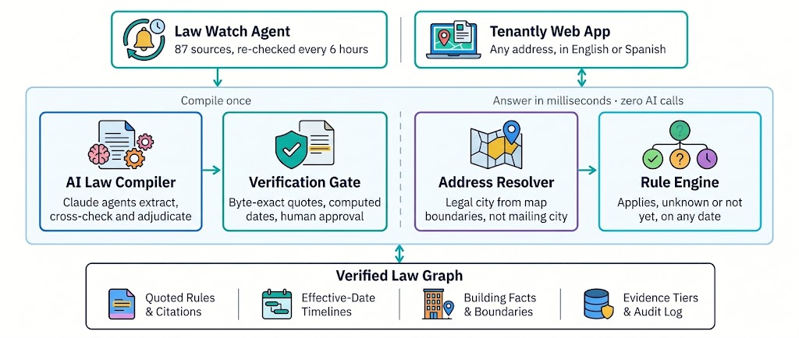
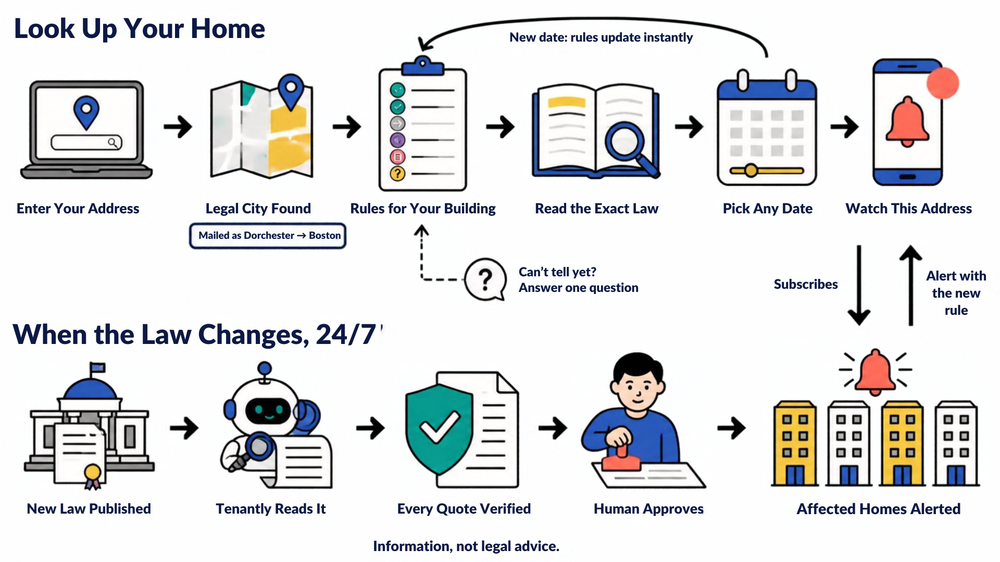

<div align="center">

# Tenantly

**The housing law that reaches your door — cited, dated, and checked against your building.**

Address in. Every applicable rent-increase, eviction, deposit, fee, screening, and algorithmic rent-setting rule out — each quoted word-for-word from the statute, with its source, retrieval date, and an honest account of what we could and couldn't verify.

[](https://tenantlyrent.me)
[](https://api.tenantlyrent.me/docs)
[](LICENSE)

*Information, not legal advice.*

</div>

---

> **For judges.** The live Ingest page is open — paste a law, extract, review, and publish. No login required. Scores and audit data are at [`/v1/proof`](https://api.tenantlyrent.me/v1/proof). Submission files are served directly from the API and are linked in [§ Outputs](#outputs). If testing a locked private instance, send `X-Admin-Token: tenantly-demo`.

---

## Contents

1. [Challenge context](#challenge-context)
2. [What Tenantly does](#what-tenantly-does)
3. [Tech stack](#tech-stack)
4. [Results](#results)
5. [How it works](#how-it-works)
6. [Architectural decisions](#architectural-decisions)
7. [Honesty by design](#honesty-by-design)
8. [Outputs](#outputs)
9. [API reference](#api-reference)
10. [Repository map](#repository-map)
11. [Reproduce everything](#reproduce-everything)
12. [Limitations](#limitations)
13. [Where this goes](#where-this-goes)
14. [Credits and licenses](#credits-and-licenses)

---

## Challenge context

Built at the **Hack-Nation 7th Global AI Hackathon · October 2026** for **RealPage Challenge 02: Rental Housing Law Navigator**.

The challenge: turn thousands of pages of state and local housing law into accurate, cited, address-level answers — extracted automatically, resolved to real buildings, and updated when the law changes.

Scope: **3 states (CA, NJ, MA) · 10 cities · 6 rule categories · 500 real buildings · 87 source documents**.

---

## What Tenantly does

| For a renter | For an advocate or agency | For a small housing provider |
|---|---|---|
| Type an address and see every applicable rule per category — what applies now, what starts later, and what is only proposed | Pick a law change and see which buildings it reaches, before and after | Coverage conditions and exemptions spelled out in the law's own words |
| Read the exact quoted sentence behind every answer, with retrieval date | Conflict flags where state and local law may collide | The same starting evidence a lawyer uses — never advice, never ways around a rule |
| Date slider: explore any date instantly with no network request | CSV-ready change sets and a full compile audit log | Email or Atom-feed alerts when a law affecting that building changes |

### System architecture



### User flow



### Feature matrix

| Feature | Status |
|---|---|
| **Module A — Rule extraction** (automated; no hand-coding) | ✅ 84 rules, 100% byte-verified quotes |
| **Module B — Address lookup** with cited jurisdiction stack | ✅ 500 addresses, all 6 rule categories |
| **Module C — Change tracking** T1–T6 with as-of date query | ✅ All tests passing |
| **Bitemporal date slider** — instant, zero network round-trip | ✅ Precomputed timelines |
| **Plain-language summaries** | ✅ English; mean reading grade 9.5 |
| **Confidence scores and conflict flags** | ✅ Evidence tiers A / B / C / C1 per rule |
| **Live law ingestion** — paste URL or text, extract, review, publish | ✅ SSE progress stream, human Publish/Reject |
| **Autonomous extraction judge** — re-runs adjudicator on demand | ✅ `/v1/ingest/{id}/rejudge` |
| **Email watch alerts** — Resend; notifies subscribers when affecting law changes | ✅ Degrades gracefully if key absent |
| **Atom feed + ICS calendar** per address | ✅ `/v1/alerts/feed/{id}.atom` + `.ics` |
| **Law Watch** — scans official allow-listed sources on schedule | ✅ Staged; never auto-published |
| **Stretch: new jurisdiction live during event** | ✅ Rehearsed on fictional Cambridge ordinance (T6 fixture) |

---

## Tech stack

| Layer | Technology |
|---|---|
| **Backend language** | Python 3.12, uv (package + venv manager) |
| **API framework** | FastAPI, Pydantic v2, Uvicorn |
| **AI models** | Anthropic Claude — Haiku 4.5 (cross-check), Sonnet 5.5 (extract), Opus 5.5 (adjudicate) |
| **Frontend framework** | React 19, TypeScript, Vite 8 |
| **Routing + data fetching** | TanStack Router v1, TanStack Query v5 |
| **UI components** | shadcn/ui, Radix UI, Tailwind CSS v4 |
| **Maps** | MapLibre GL + react-map-gl (OpenFreeMap tiles) |
| **Charts** | Recharts |
| **Geocoding** | U.S. Census Geocoder + TIGER/Line shapefiles |
| **Email alerts** | Resend |
| **Backend hosting** | Render (Docker, free tier) |
| **Frontend hosting** | Vercel |
| **Custom domain** | tenantlyrent.me (Namecheap) |
| **Testing** | pytest (backend), Vitest + Testing Library (frontend) |
| **Linting** | Ruff (Python), ESLint + Prettier (TypeScript) |

---

## Results

All values are measured. See `artifacts/eval/` and the live [Proof page](https://tenantlyrent.me/proof).

### Self-score (mirrors the published rubric)

| Component | Max | Self-score |
|---|---|---|
| Extraction accuracy | 25 | **25.0** |
| Address coverage | 20 | **17.5** |
| Citations | 15 | **14.8** |
| Change tracking | 15 | **15.0** |
| **Total (auto-graded)** | **75** | **72.3** |

### Change tests

| Test | What it checks | Result |
|---|---|---|
| T1 | CA AB 325 / SB 763 — `2025-12-31 → 2026-01-02` | 250 CA buildings flip from `not_yet_effective` to `applies` ✓ |
| T2 | Hoboken vs. Jersey City local bans — neither in Newark | 40 + 50 = 90 affected; 0 in Newark ✓ |
| T3 | NJ FAIR Act — signed 2026-07-20, effective 2027-07-01; possible preemption | 140 affected; 90 conflict flags ✓ |
| T4 | MA S.2983 / H.5222 (pending bills) — never enacted | 110 MA addresses; reported as `pending`, never `applies` ✓ |
| T5 | MA rent-control ballot question — struck 2026-06-23 | 0 affected; recorded as `failed` ✓ |
| T6 | Hour-16 fictional Cambridge ordinance | Ingest path rehearsed on fixture; correct effective date extracted ✓ |

### Integrity and performance

| Metric | Value |
|---|---|
| Rules extracted (Tier A / B / C / C1) | 25 / 59 / 4 / 1 = **89 total** |
| Tier A/B quotes verified byte-for-byte | 84 / 84 — **100%** |
| Candidate rules rejected (quote not in source) | 498 |
| Buildings resolved by geometry | 499 |
| Mailing-city mismatches caught (e.g. Dorchester → Boston) | 37 |
| Suspect ZIPs dropped before geocoding | 83 |
| Unit counts recovered from public descriptions | 90 |
| Contradicting public records flagged (never guessed) | 12 |
| Mean reading grade of plain-language summaries | 9.48 |
| Lookup latency p50 / p95 (server, no model) | 7.8 ms / 15.3 ms |
| Retrieval + LLM baseline (same question) | 6.4 s |
| Total model spend to compile the corpus | $3.61 of a $6.00 cap |

---

## How it works

Tenantly is a **law compiler**, not a chatbot. Models read the law once at compile time into a verified, time-aware rule graph. Answering an address query is deterministic code over that graph — no model call on the lookup path.

```
87 sources ──► Load (SHA-256 verify · boilerplate mask · version segments)
           ──► Extract (2 independent Claude Sonnet passes + Haiku cross-check)
           ──► Verify (byte-exact quotes at recorded offsets — 498 rejected)
           ──► Adjudicate (Claude Opus · disagreements only · must cite span)
           ──► Legal calendar (code computes dates from statutory expressions)
           ──► Evidence tiers + 13×6 gap audit + precedence links
           ──► Rule graph

500 buildings ──► Facts with intervals + provenance
              ──► Geocode → point-in-polygon on Census TIGER boundaries
              ──► Resolved buildings

Rule graph + Resolved buildings ──► Three-valued Kleene engine over time
                                ──► Precomputed bitemporal timelines
                                ──► rules.json · lookups.json · changes.json
                                ──► API + app + static snapshot

Law Watch (every 6 h) ──► same DAG ──► staged overlay ──► human review
```

### Compile time (~8 min, ~$3.61; cached reruns cost near zero)

1. **Load** — Verify each document's SHA-256 against the manifest. Mask web boilerplate *without* changing byte offsets. Split statutes containing multiple versions into dated segments.
2. **Extract** — Two independent Claude Sonnet passes (section view + whole-document view) plus a Claude Haiku cross-check. Disagreements go to a Claude Opus adjudicator that must cite the deciding span.
3. **Verify** — Every quoted span must be an exact substring of the raw source at recorded offsets. Anything else is rejected (498 candidates rejected in this run).
4. **Compute dates** — Models extract date *expressions*; code computes the final dates. Example: `"first day of the twelfth month next following the date of enactment"` + `"approved July 20, 2026"` → **2027-07-01**.
5. **Audit gaps** — A 13 × 6 jurisdiction-by-category matrix must be fully explained: each cell holds a rule or a reasoned "no rule at this level".
6. **Link** — Precedence and conflicts become explicit graph edges with quoted evidence (e.g. SF rent cap supersedes AB 1482; NJ FAIR Act may preempt Jersey City and Hoboken bans).

### Query time (milliseconds, zero model calls)

1. **Resolve** the building's legal city by point-in-polygon on Census TIGER boundaries — incorporated places in CA, county subdivisions in NJ and MA. Never by mailing city.
2. **Evaluate** each rule's coverage with three-valued Kleene logic over interval facts.
3. **Serve** a precomputed timeline. The date slider requires no network request.

---

## Architectural decisions

| Decision | Typical approach | Tenantly | Why |
|---|---|---|---|
| **Where models run** | Every query | Compile and ingest only | Millisecond answers; no query-time hallucination; reproducible outputs |
| **Citations** | Model-written | Byte-exact spans verified at recorded offsets | Citation validity is a system property, not a hope |
| **Dates** | Model guesses | Deterministic legal calendar | The rules most likely to be misdated are dated correctly |
| **Missing facts** | Guess, or treat as false | Kleene logic over intervals: `unknown` is computed, explained, and paired with the one question that resolves it | Honest coverage without invented answers |
| **Building facts** | Use raw cell value | Derive with provenance; intersect sources; flag contradictions | Recovers unit counts parcel data left blank |
| **Jurisdiction** | Postal city string | Census TIGER geometry, right Census layer per state; suspect ZIPs dropped first | Dorchester → Boston; San Ysidro → San Diego; 83 NJ owner-mailing ZIPs neutralized |
| **Time** | Re-query per date | Bitemporal timelines precomputed per building | Instant date slider; change tracking is a diff, not a recomputation |
| **Orchestration** | Free-roaming agents | Deterministic, content-addressed DAG; bounded agents with forced tool outputs | Predictable cost, replayable runs, a demo that cannot fail |
| **Gaps in sources** | Silence or invention | Evidence tiers (A/B/C/C1) | Honest coverage of laws whose text wasn't supplied |
| **New law** | Overwrite | Staged overlay + blast-radius preview + human Publish/Reject; Law Watch opens pull requests | Humans approve what renters see |

---

## Honesty by design

### Evidence tiers

Every rule carries a tier, visible in the app and in `conflict_note`:

| Tier | Meaning | Quote source |
|---|---|---|
| **A** | Official law text supplied in the corpus | Corpus, byte-verified |
| **B** | Official agency page in the corpus describing the law | Corpus, byte-verified |
| **C** | Law text *not supplied* (link-only); confirmed by ≥2 independent supplied signals | Named supplementary document, verbatim. Never invented. Confidence ≤ 0.6 |
| **C1** | Only one signal | Same as C; result always `unknown` |

### Open questions surfaced automatically

- Berkeley's algorithmic-pricing ordinance has two published effective dates; both precede the query date so the answer is unaffected — stated explicitly.
- Los Angeles's RSO increase (3%) was valid only through June 30, 2026; the current figure is not in our sources for an October 2026 query.
- California's screening-fee cap has no single official 2026 figure (statute: $30 adjusted for CPI; Berkeley Rent Board: $68.96).
- NJ FAIR Act may preempt Jersey City and Hoboken ordinances from July 1, 2027 — those buildings carry a conflict flag.

### Guardrails

- Never legal advice — every screen and every API response carries the disclaimer.
- Never invented facts, dates, or citations. `"Unknown"` means `null`.
- Never guessed effective dates — computation is deterministic code.
- Full audit trail: every model call logged with model, prompt version, input/output hashes, verifier result, and cost (`artifacts/audit/compile_audit.jsonl`).
- Eval isolation enforced by test: `eval/silver_key.yaml` is never importable by `engine/`.

---

## Outputs

The three submission files are committed to this repo and served live from the API:

| File | Contents | Live endpoint |
|---|---|---|
| [`out/rules.json`](out/rules.json) | 89 rule records in the official schema (including pending and failed measures), with citation, quoted span, tier, and evidence | [`/v1/submission/rules.json`](https://api.tenantlyrent.me/v1/submission/rules.json) |
| [`out/lookups.json`](out/lookups.json) | All 500 addresses as of 2026-10-01; each rule result ∈ `applies` / `unknown` / `superseded` / `not_yet_effective` / `pending` | [`/v1/submission/lookups.json`](https://api.tenantlyrent.me/v1/submission/lookups.json) |
| [`out/changes.json`](out/changes.json) | Affected and conflict-flagged address sets for change tests T1–T6 | [`/v1/submission/changes.json`](https://api.tenantlyrent.me/v1/submission/changes.json) |

Additional outputs: [`METHOD_NOTE.md`](METHOD_NOTE.md) (one-page method note generated from artifacts).

---

## API reference

OpenAPI docs: [`https://api.tenantlyrent.me/docs`](https://api.tenantlyrent.me/docs)

| Endpoint | Purpose |
|---|---|
| `GET /v1/lookup/{address_id}?as_of=YYYY-MM-DD` | Full answer for one building on one date |
| `GET /v1/timeline/{address_id}` | Every dated segment per building (powers the instant date slider) |
| `POST /v1/lookup/custom` | Re-evaluate with user-supplied facts, labeled "based on what you told us" |
| `GET /v1/sources/{doc_id}?rule_id=` | Source text with the quoted span highlighted |
| `GET /v1/changes/{id}` | Before/after rule set per affected building |
| `POST /v1/ingest` | Compile a new law into a staged overlay — public in demo mode; progress via SSE |
| `POST /v1/ingest/{id}/rejudge` | Re-run the autonomous adjudicator judge |
| `POST /v1/alerts/subscriptions` | Subscribe to watch alerts for an address |
| `GET /v1/alerts/feed/{address_id}.atom` | Atom feed for an address |
| `GET /v1/alerts/calendar/{address_id}.ics` | ICS calendar for an address |
| `GET /v1/submission/{rules\|lookups\|changes}.json` | Submission files |
| `GET /v1/proof` | Measured scores, verification stats, latency, cost, open questions |
| `GET /v1/audit` | Full compile audit log |

Every response includes `Server-Timing`, `data_version`, `as_of`, `sources_retrieved_at`, `is_projection`, and `disclaimer`.

---

## Repository map

```
engine/
  corpus/     document loading, boilerplate masking, version segments, doc types
  compile/    DAG, model calls (content-addressed cache + ledger + audit), verifier, legal calendar, evidence tiers
  geo/        Census geocoding, TIGER boundaries, point-in-polygon
  facts/      use-code derivations, interval facts, record conflict detection
  rules/      three-valued Kleene engine, precedence, bitemporal timelines, change tests
  export/     submission files, static snapshot, method note
  api/        FastAPI service — routers, SSE, error envelope, deps, middleware
  watch/      Law Watch agent, Resend email alerts, Atom/ICS feeds
frontend/     React 19 + Vite + TanStack Router + TanStack Query + MapLibre + shadcn/ui
eval/         self-scorer and silver key (enforced never to be read by engine/)
tests/        traps, change tests, contract tests, eval isolation
out/          rules.json · lookups.json · changes.json  ← submission outputs
artifacts/    compiled rules, resolved addresses, audit logs, eval results
```

---

## Reproduce everything

```bash
git clone https://github.com/Esh90/Tenantly.git && cd Tenantly
# Place the starter pack in dataset/ (read-only) and dataset_supplement/
make setup                          # uv sync + .env scaffold
echo "ANTHROPIC_API_KEY=sk-..." >> .env
make compile ARGS=--explain         # preview stages and cost before spending
make all                            # full pipeline: compile → geo → resolve → lookups → timelines → changes → export → score → snapshot
make test                           # full suite: traps, T1–T6, contract, eval isolation
make serve                          # API at http://localhost:8000/docs
```

Re-runs are deterministic. Every compile stage is content-addressed; the same inputs produce the same outputs without new model calls. Live ingest: `make ingest-file FILE=<path>` or use the Ingest tab at [tenantlyrent.me/ingest](https://tenantlyrent.me/ingest).

---

## Where this goes

- **The thesis.** Housing law is a fast-changing, address-keyed dataset that nobody maintains as data. Tenantly compiles it once, verifies every claim, and keeps it current with a change feed that says *which buildings* each new law touches.
- **Why the design extends.** Adding a city means adding documents and a boundary identifier and running one command. Law Watch keeps the graph current at near-zero cost when nothing changes; every new rule passes the same quote verification and human review.
- **Near-term milestones.** Expand to the 14 jurisdictions with algorithmic rent-setting bans · add county layers · open-source the verified rule dataset as a public good, with partners, as the challenge brief invites.

---

## Credits and licenses

Built at the **Hack-Nation 7th Global AI Hackathon · October 3–4, 2026** for **RealPage Challenge 02: Rental Housing Law Navigator**.

- **Data** — Starter pack: public statutes, ordinances, and agency pages; public assessor parcel records. U.S. Census Bureau Geocoder and TIGER/Line (public domain). Map data © OpenStreetMap contributors, via OpenFreeMap / OpenMapTiles.
- **Models** — Anthropic Claude (Haiku 4.5, Sonnet 5.5, Opus 5.5), at compile time only.
- **Email alerts** — Resend.
- **Code** — MIT License. See [LICENSE](LICENSE).

---

*Tenantly displays public housing law for information only. It is not legal advice. Verify with the official source or a qualified professional before acting.*
